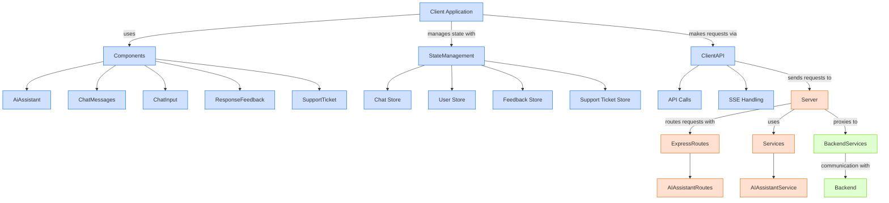
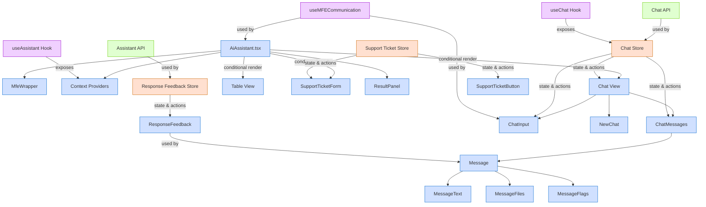
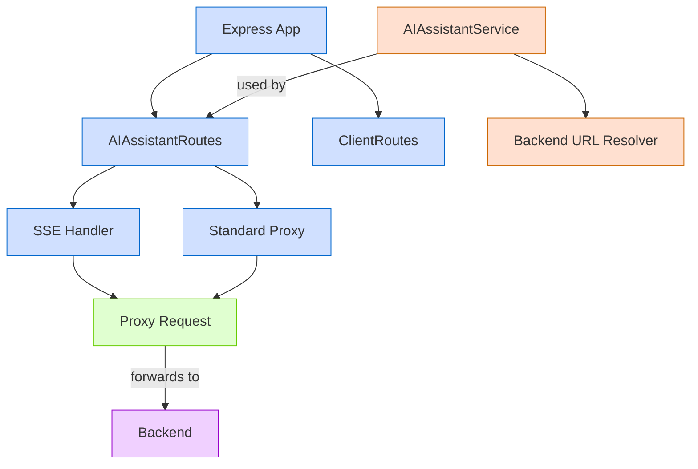
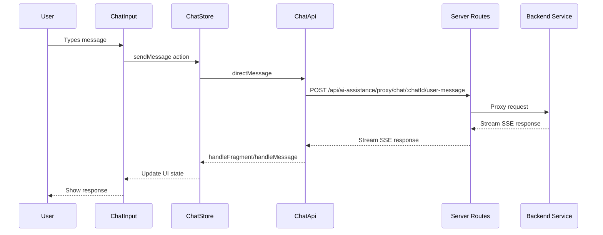

# Architecture Diagrams

This file contains Mermaid diagram code that can be used to generate architecture diagrams for the  Assistant MFE.

## Application Architecture Diagram

## Client-Side Architecture Diagram

## Server-Side Architecture Diagram

## Data Flow Diagram

You can use these diagrams in your documentation by either:

1. Using a Mermaid-compatible renderer (like GitHub or many markdown editors)
2. Copying the code into a Mermaid live editor (https://mermaid.live/) to generate an image
3. Using a Mermaid CLI tool to generate static images

The diagrams provide a visual representation of the application architecture, component relationships, and data flow.
